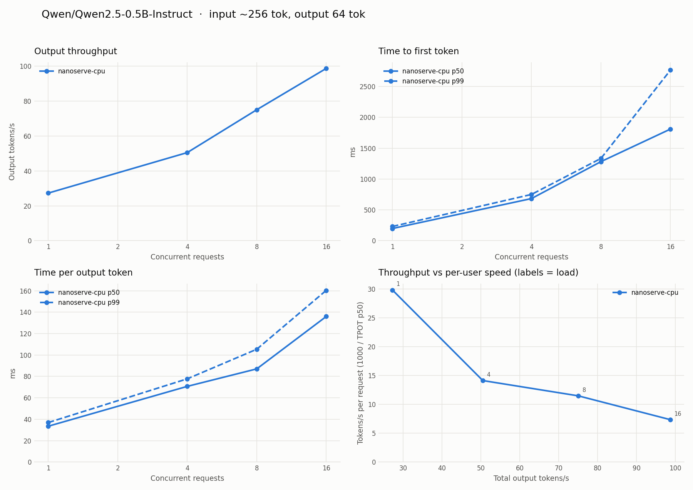

# nanoserve

A small LLM inference engine, built step by step to learn how vLLM works
inside. Each step is checked against the Hugging Face reference
implementation.

| Step | What | Status |
|---|---|---|
| 1 | Qwen2 written from scratch (GQA, RoPE, SwiGLU, RMSNorm), loading HF safetensors | ✅ |
| 2 | Paged KV cache: fixed-size blocks, block allocator, per-sequence block tables | ✅ |
| 3 | Continuous-batching scheduler: mixed prefill + decode, preemption when blocks run out | ✅ |
| 4 | OpenAI-compatible streaming server, measured with [`benchmarks/`](../benchmarks/README.md) | ✅ |
| 5 | Head-to-head with `vllm serve` on the same GPU, with a write-up of the gap | script ready; needs a GPU run |

## Design

- **Flat token batches.** The model takes `input_ids` and `positions` of shape
  `[num_tokens]`, not padded `[batch, seq_len]`. One forward pass can then mix
  prompt tokens from new requests with single decode tokens from running ones,
  which is what continuous batching needs.
- **Stateless model, pluggable attention.** The KV cache lives in an attention
  backend passed into `forward`. Step 1 uses `ContiguousKVCache` (one sequence,
  `max_len` slots reserved up front). Step 2 swaps in a paged backend without
  touching the model.
- **Logits only where needed.** `compute_logits` runs the LM head on just the
  rows being sampled. For a 1,000-token prompt that skips a `[1000, 151936]`
  matmul.
- **RoPE tables stay float32** when weights are cast to bf16/fp16, because
  low-precision cos/sin drift at long positions.

## Paged KV cache (step 2)

`paged_attention.py` splits KV memory into fixed-size blocks of `block_size`
tokens. Each sequence has a **block table** mapping its logical blocks to
physical ones. Token `p` lives in block `block_table[p // block_size]` at
offset `p % block_size`. Blocks are allocated as a sequence grows and freed
the moment it finishes.

Why it matters, in numbers for Qwen2.5-0.5B in bf16:
- **KV cache per token:** 2 (K and V) × 24 layers × 2 KV heads × 64 dims ×
  2 bytes = **12 KiB**.
- **Contiguous cache:** must reserve the full context for every sequence:
  32,768 tokens × 12 KiB = **384 MiB per sequence**, even for a 50-token
  reply.
- **Paged cache, 16-token blocks:** wastes at most 15 slots (180 KiB) per
  sequence.

That difference is how many sequences fit in the batch at once, and batch size
is where throughput comes from.

One forward pass can carry a mix of sequences, each adding any number of
tokens: a whole prompt (prefill) or one token (decode). `begin_step` takes
`(seq_id, num_new_tokens)` pairs, allocates the blocks, and returns token
positions plus a **slot mapping**: where each new token's K/V gets written.

`generate_batch` prefills all prompts in one pass, then decodes every running
sequence together, freeing blocks as sequences hit EOS. On an M-series CPU
with 8 prompts, it produces output identical to running them one at a time,
**3.1× faster** (97 vs 31 tok/s).

**Limitation:** attention gathers each sequence's blocks into a contiguous
tensor, then runs SDPA per sequence in a Python loop. That's correct but slow.
vLLM's PagedAttention kernel reads K/V straight from the scattered blocks
inside the kernel, for the whole batch at once.

## Continuous batching (step 3)

`engine.py` has an `LLMEngine` that accepts requests at any time. Each
`step()` the scheduler builds a fresh batch under a token budget
(`max_num_batched_tokens`), in the same order as vLLM's V1 scheduler:

1. **Running requests first, oldest first.** A request still prefilling gets
   its next prompt chunk; a decoding request gets one token. If no KV block
   is free, the **newest** running request is **preempted**: its blocks are
   freed and it goes to the front of the waiting queue. When it's rescheduled,
   it recomputes its KV from prompt + output so far (vLLM's default
   "recompute" mode, rather than swapping to CPU).
2. **Then waiting requests**, first come first served, while the budget,
   `max_num_seqs` and free blocks allow. A prompt bigger than the remaining
   budget is split across steps (**chunked prefill**), so a 4,000-token
   prompt can't stall every running decode for a whole step.

A request samples a token only in a step where its scheduled tokens reach the
end of everything it knows: the last prompt chunk, or a decode step.

**Measured on the real model:** Qwen2.5-0.5B on an M-series CPU, 16 requests,
at most 8 running at once, output lengths mixed between 8 and 128 tokens:

| | Wall time | Useful tok/s | Mean TTFT |
|---|---|---|---|
| Static batching (groups of 8, each group runs to its longest request) | 12.7 s | 69 | ~5.1 s |
| Continuous batching (finished requests replaced immediately) | 9.8 s | 90 | 1.8 s |

The two give identical outputs. Static batching wastes decode slots on
requests that already finished, and makes new requests wait for the slowest
request in the group. The more uneven the output lengths, the bigger the gap.

**Tests** (`tests/test_nanoserve_engine.py`) put the scheduler under pressure
and require greedy output identical to one-request-at-a-time generation:
- a `max_num_seqs` cap, which leaves requests queued;
- a tiny token budget, which forces chunked prefill;
- a cache too small for the workload, which forces preemption and recompute;
- requests arriving mid-flight.

They also check invariants: the token budget is never exceeded, decodes keep
running while a long prompt is chunked in, every block is freed at the end,
and seeded sampling is reproducible.

## OpenAI-compatible server (step 4)

```bash
python -m nanoserve.server --model Qwen/Qwen2.5-0.5B-Instruct --port 8000 --kv-cache-gb 1
curl localhost:8000/v1/chat/completions -H 'Content-Type: application/json' \
  -d '{"messages": [{"role": "user", "content": "What is a KV cache?"}], "stream": true}'
```

`server.py` serves `/v1/completions` and `/v1/chat/completions`, streaming
(SSE) or not, plus `/v1/models`, `/health` and `/metrics`. The metrics endpoint
reports running/waiting requests, free blocks, preemptions and aborts.

- **Engine on its own thread.** A forward pass blocks, so it can't run on the
  asyncio event loop. HTTP handlers hand requests and aborts to the engine
  thread through a thread-safe inbox. The engine thread pushes each token
  back to the handler's `asyncio.Queue` with `call_soon_threadsafe`. Between
  steps it drains the inbox, so a new request joins the very next batch.
- **Client disconnects abort the request** and free its KV blocks right
  away, instead of generating tokens nobody will read.
- **Incremental detokenization** decodes the whole output and emits the new
  suffix, holding back a trailing U+FFFD until a multi-byte character is
  complete. Decoding token by token would garble emoji and CJK text.
- **`--kv-cache-gb`** sizes the paged cache the way vLLM's
  `--gpu-memory-utilization` does. 1 GB = 2,730 blocks of 16 tokens = 43,680
  tokens for Qwen2.5-0.5B in fp32.

**Benchmarked with [`benchmarks/serving_benchmark.py`](../benchmarks/README.md)**
on an M-series CPU, fp32, 256-token prompts, 64-token outputs. All 128
requests succeeded:



| Concurrency | Output tok/s | TTFT p50 | TPOT p50 |
|---|---|---|---|
| 1 | 27 | 198 ms | 34 ms |
| 4 | 51 | 683 ms | 71 ms |
| 8 | 75 | 1,282 ms | 87 ms |
| 16 | 99 | 1,810 ms | 136 ms |

Batching buys 3.6× throughput, and each user pays for it in per-token
latency. That's the central trade-off of LLM serving. On a CPU the decode
step is compute-bound, so TPOT grows almost linearly with batch size. On a
GPU, decode is memory-bandwidth-bound, so TPOT stays nearly flat until the
batch is large. That's why GPUs batch so well, and step 5 will show it.

## vLLM vs nanoserve on a GPU (step 5)

`benchmarks/compare_engines.sh` runs the whole comparison on one rented GPU:

1. It benchmarks `vllm serve`.
2. It benchmarks nanoserve with the same model, dtype, `max_num_seqs` and
   workload.
3. It profiles a nanoserve decode step.
4. It writes the plots, a side-by-side table and the logs to
   `benchmarks/results/gpu/`.

```bash
# On the GPU machine (any NVIDIA GPU with 16 GB+; an L4 or A10G costs ~$1/hour)
git clone https://github.com/Kunal-Chandarana/vLLMLearning.git && cd vLLMLearning
bash benchmarks/compare_engines.sh          # ~20-30 min
# copy benchmarks/results/gpu/ back, commit it
```

**What to expect, and why.** nanoserve has the same *algorithms* as vLLM
(paged KV cache, continuous batching, chunked prefill). The gap comes from
*execution*:

- **CPU launch overhead.** Each decode step, nanoserve issues hundreds of
  small GPU kernels from Python: per layer, and per sequence inside the
  attention loop. The GPU finishes each one in microseconds, then waits for
  Python. `profile_step.py` reports this directly as GPU busy time / wall
  time. vLLM records the whole decode step once as a **CUDA graph** and
  replays it with a single launch.
- **Attention kernel.** nanoserve copies each sequence's scattered blocks into
  a contiguous tensor, then runs attention one sequence at a time. vLLM's
  **PagedAttention / FlashAttention kernels** read the blocks in place, for the
  whole batch, in one launch.
- **Fused ops.** vLLM fuses RMSNorm, RoPE, SiLU-and-multiply and residual adds
  into single kernels. nanoserve runs each as separate PyTorch ops, and each op
  is another round trip to GPU memory.
- **Sampling and scheduling.** vLLM batches sampling on the GPU and overlaps
  CPU scheduling with GPU work. nanoserve does both serially in Python.

Expect the gap to be **largest at high concurrency**: nanoserve's per-sequence
attention loop grows with the batch, while vLLM's kernels barely notice. At
concurrency 1 the gap is mostly launch overhead.

## Usage

```bash
pip install torch transformers safetensors huggingface_hub
python -m nanoserve.generate --chat --prompt "What is a KV cache?" --max-tokens 128
python -m nanoserve.generate --device mps --dtype float16   # Apple GPU
```

## Tests

```bash
pytest tests/test_nanoserve_model.py                          # tiny random model, no download
NANOSERVE_REAL_MODEL=1 pytest tests/test_nanoserve_model.py   # + Qwen2.5-0.5B-Instruct (~1 GB)
pytest tests/test_nanoserve_paged.py                          # paged cache vs contiguous, batching
pytest tests/test_nanoserve_engine.py                         # scheduler: chunking, preemption, arrivals
pytest tests/test_nanoserve_server.py                         # HTTP: streaming, batching, disconnects
```

The tests check prefill logits, prefill followed by token-by-token decode, and
greedy generation against `transformers`. For the real model, the full-sequence
logits match exactly in float32.

Two traps in comparing against `transformers.generate`:
- **Pass an `attention_mask`.** Qwen's pad token is its EOS token, so
  `transformers` can't infer the mask.
- **Set `repetition_penalty=1.0`.** The checkpoint's `generation_config.json`
  sets it to 1.1, which applies even under greedy decoding.
